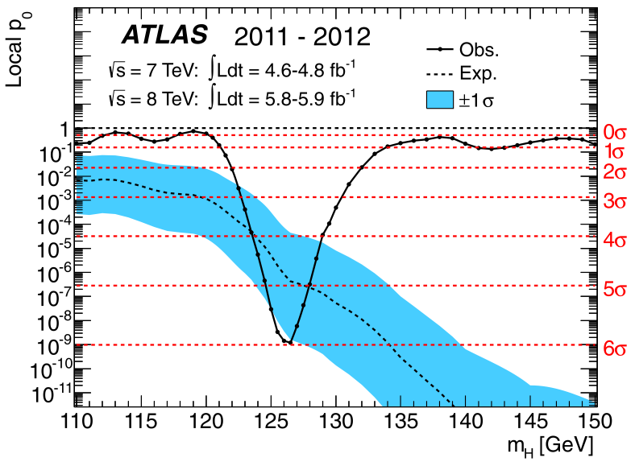

Introduction
===============================================================================

<!--

-->

What this is for
-------------------------------------------------------------------------------

This project is meant to make writing easier and more productive.

So you want to write a document. Maybe you'll share it on the web.
Maybe you want a polished pdf. Maybe it's a blog, research paper, book draft,
or just a set of notes.
You *don't* want to think about typesetting details.
You just want to throw your ideas in some plain text files and call make.

This package makes it very easy to compile text taken in Markdown to valid
xhtml or to a pdf via LaTeX. It can be used to make simple webpages quickly,
for example:   
<http://rreece.github.io/sw/markdown-memo/>

This same document compiled to a pdf can be found here:   
<http://rreece.github.io/sw/markdown-memo/example.pdf>

How it works
-------------------------------------------------------------------------------

[Markdown](https://daringfireball.net/projects/markdown/)
is a very simple markup language for writing documents
that basically looks as if you were to write your ideas in a plain-text
email.  In this package, we aim to hide some of the boiler-plate issues
of compiling a completely formatted document or webpage from Markdown,
trying to make it as trivial as possible to get your ideas out.

Most of the heavy-lifting work underneath `markdown-memo` is done
by the [pandoc](http://pandoc.org/) program, which does the actual
compilation of Markdown to html or pdf.

Most of the magic in the implementation of `markdown-memo`
is in its [Makefile](https://github.com/rreece/markdown-memo/blob/master/Makefile),
which basically calls pandoc in various useful configurations
and applies some hacks to the output using the tools in `scripts/`.

**Keep content and style separated.**

The idea is that all user *content* should be in plainly written `*.md` files
and one metadata file: `meta.yaml`.
All *stylistic* issues should be implemented in the details of the files
in `templates/` and configurable through `meta.yaml`,
and unless you want to,
you shouldn't have to worry about them.

For example, [see what changes](http://rreece.github.io/sw/markdown-memo-alt/01-introduction.html)
when this document is created with

    css: 'templates/markdown-memo-alt.css'

set in `meta.yaml`, instead of the css file used in the
[default version](http://rreece.github.io/sw/markdown-memo/01-introduction.html):

    css: 'templates/markdown-memo.css'

